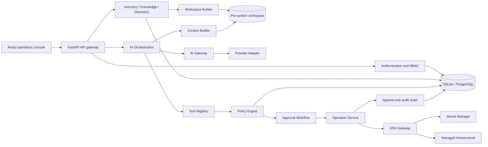
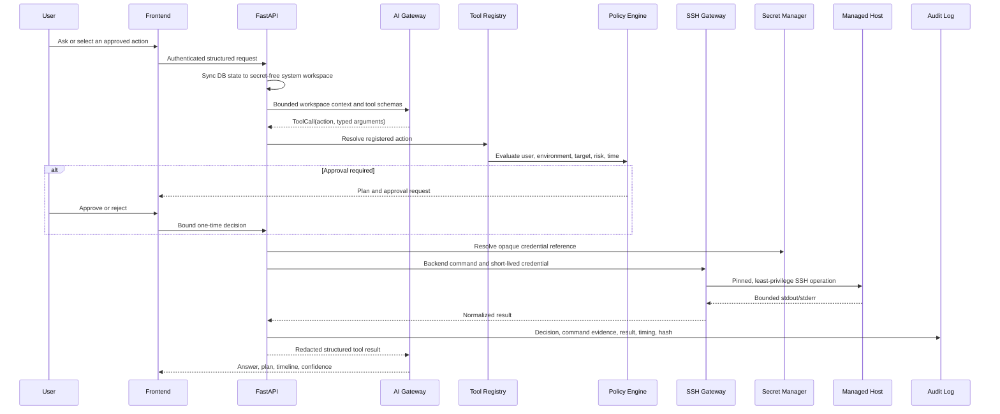

# AIOps Platform Project Documentation

This is the canonical technical document for the AIOps Platform. It is intended for engineers and
AI coding agents joining the project. The root `README.md` contains the short bootstrap path; this
document owns architecture, module boundaries, extension rules, security decisions, and operations.

For a single implementation-level onboarding document that reflects the latest verified Web and
Backend state, read [AI_AGENT_SYSTEM_GUIDE.md](AI_AGENT_SYSTEM_GUIDE.md) first.

## 1. Product Goal

The platform provides governed infrastructure operations assisted by AI. AI is an orchestrator, not
an infrastructure principal. It receives sanitized inventory, knowledge, registered tool schemas,
and bounded tool results. It never receives SSH usernames, passwords, private keys, certificates,
tokens, connection strings, decrypted secrets, or permission to submit arbitrary shell commands.

Primary capabilities:

- Inventory for systems, environments, servers, credentials, tags, and operational metadata.
- Per-system AI workspaces with provider-neutral adapters, operational memory, plans, tool timelines,
  and confidence. AI context is selected from workspace files, never queried from the database.
- Backend-owned Tool DSL, policy decisions, human approval, SSH execution, and immutable audit.
- Infrastructure discovery, dependency inference, topology visualization, snapshots, and schedules.
- Knowledge documents and per-system graph data for retrieval and operational context.
- Report generation, preview, comparison, export, and history.
- Development-only deterministic infrastructure simulation through the production control path.
- Administrative configuration for users, RBAC, AI providers, plugins, notifications, gateways,
  report templates, policies, and persisted tool metadata.

## 2. Architecture

The current runtime is a modular monolith. Domain and service boundaries are deliberately explicit
so a module can later be extracted into a service without changing the public API contracts.



### Trust boundaries

- Browser: receives JWT access tokens and opaque rotating refresh tokens only.
- API: validates payloads, authentication, permission, rate limits, and request context.
- AI boundary: receives sanitized context and declared tools; no database or SSH client is exposed.
- Tool boundary: maps an action and validated arguments to a backend-owned command template.
- Policy boundary: decides `allow`, `deny`, or `approval_required` for every target operation.
- Secret boundary: only Secret Manager can decrypt credentials; plaintext lifetime is operation-bound.
- SSH boundary: short-lived connection, host-key verification, timeout, retry, output limit, close.
- Audit boundary: append-only runtime ORM controls and SHA-256 chaining expose tampering; explicit
  Admin retention endpoints may delete records and atomically rebuild the remaining chain.

### Intended service extraction

The module boundaries map to future API Gateway, Authentication, Inventory, Knowledge, AI, SSH
Gateway, Policy, Secret Manager, Audit, Report, Plugin, and Notification services. Extraction should
replace in-process calls with versioned internal APIs or queue events, add an outbox, and preserve the
existing domain contracts. PostgreSQL, Redis coordination, object storage/vector search, and WORM
audit replication are production scale-out steps, not prerequisites for local development.

## 3. Repository Structure

```text
AI_Ops_Tool/
  backend/
    app/
      ai/                 Provider interfaces, manager, gateway, adapters
      api/                FastAPI dependencies and versioned routes
      core/               Settings, security, telemetry, exceptions
      db/                 Async engine/session and SQLAlchemy base
      domain/             ORM entities and domain enums
      middleware/         Request ID, headers, rate limiting, logging
      repositories/       Persistence boundaries
      schemas/            Pydantic request/response contracts
      services/           Application orchestration and security controls
      workspace/          Atomic storage, workspace projection and bounded context selection
      workers/            Discovery schedule worker
    alembic/              Ordered database migrations
    config/               AI provider configuration
    tests/                Unit, security, integration, and functional tests
  ShadcnTemplateFE/
    src/
      components/         Shared enterprise UI and data-table primitives
      context/            Theme, direction, layout, search, font providers
      features/aiops/     Product screens and workflows
      routes/             TanStack file routes and authorization boundaries
      stores/             Authenticated client state
      lib/                API client, token rotation, validation utilities
  docker/                 Backend/frontend images and nginx configuration
  scripts/                Setup, seed, run, test, reset, and scheduler commands
  docs/PROJECT_DOCUMENTATION.md
  docker-compose.yml
  README.md
```

Generated output (`dist`, caches, logs, local databases, virtual environments, and `node_modules`)
is not source and must remain ignored.

## 4. End-to-End Operation Flow



The frontend and AI cannot send shell text. Examples such as `check_disk` are action identifiers.
`ToolRegistry` selects the reviewed Linux/Windows/Docker/Kubernetes command and rejects unsafe or
unknown arguments before policy and transport execution.

## 5. Backend Modules

### Authentication and authorization

- Bcrypt password hashes with bounded input.
- JWT access tokens validate issuer, audience, type, required claims, and expiry.
- Refresh sessions are opaque database records, rotated on refresh, revocable on logout.
- `require_permission()` guards write and sensitive read routes.
- Demo roles are Admin, Operator, and Viewer; production identity federation/MFA belongs at the
  enterprise identity and ingress boundary.

### Inventory

Systems own servers. Servers reference environment and optional credential records. Public models
return opaque credential references, never encrypted payloads. Inventory is the source of target OS,
server type, role, tags, SSH metadata, and status used by tools, policy, reports, and discovery.

### Tool Registry and Operation Service

`backend/app/services/tool_registry.py` owns immutable command templates and argument validation.
`tool_configurations` stores editable description, risk, target types, and enabled state. Deleting a
tool in the UI disables it for direct execution and AI tool discovery without deleting or allowing
editing of its protected command template.

`OperationService` resolves the effective tool, verifies target support, renders the command,
validates approval, executes through SSH Gateway, and writes audit evidence.

### Policy and approval

Rules are ordered by ascending priority and can scope role, environment, server type, action, risk,
and UTC time window. No matching non-low-risk operation defaults to approval. Approval binds the
requesting actor, server, action, and normalized arguments and is consumed once. Destructive actions
should be denied by default; write operations should require approval unless narrowly allowed.

### Secret Manager and SSH Gateway

The local provider uses AES-256-GCM with randomized nonce and authenticated context. Provider
interfaces allow Vault, Azure Key Vault, AWS Secrets Manager, and OS credential stores. Production
must use external key management, pinned known-host keys, non-root service accounts, server-side
allow-lists, and minimal sudo permissions.

SSH sessions use connect and command timeouts, bounded retries/output, normalized errors, and close
after one operation. AI never receives credential material. AI may propose a read-only command only
through `run_ssh_command`; the backend command guard, SSH Command Manager, policy, approval, Gateway,
and audit remain authoritative.

## 6. Database

SQLAlchemy 2 async is used with `aiosqlite` or `asyncpg`. Switching SQLite to PostgreSQL requires a
connection-string change, not model rewrites. SQLite enables foreign keys and WAL.

Main aggregates:

- Identity: `users`, `roles`, `permissions`, `role_permissions`, `refresh_tokens`.
- Inventory: `systems`, `environments`, `servers`, `credentials`.
- Governance: `policy_rules`, `approval_requests`, `tool_configurations`,
  `ai_command_approvals` (SSH Command Manager rules).
- Evidence: `audit_logs`, `alerts`, `reports`, `report_templates`.
- AI/knowledge: `ai_provider_configurations`, `ai_sessions`, `ai_messages`,
  `knowledge_documents`.
- Platform: `plugins`, `platform_settings`, `notification_channels`, `ssh_gateway_profiles`.
- Discovery: `discovery_scans`, `discovery_schedules`.

Schema changes require an Alembic migration. Runtime schema auto-creation is disabled by default.

```bash
cd backend
python -m alembic upgrade head
python -m alembic revision --autogenerate -m "describe change"
python -m alembic downgrade -1
```

Review generated migrations. Test upgrade and rollback in staging and back up production first.
For multiple API writers, serialize audit appends or use PostgreSQL locking and replicate the chain
to immutable storage.

For a new or repaired SQLite development installation:

```powershell
.\scripts\init_sqlite.ps1
```

The initializer is idempotent, runs all migrations, and creates the required Admin role/user and
baseline platform records. `ROWS_PER_PAGE` defaults to `100`, is validated between `100` and `1000`,
and is shared by backend pagination and frontend Enterprise DataTables.

### Enterprise SSH operations

SSH Command Manager supports two target scopes. A scoped rule binds an exact normalized command
to one System and Server. A Global rule leaves both references empty and applies to every compatible
target for the selected user; an exact server rule always takes precedence over a Global rule.

SSH Credentials can be System-specific or Global. Systems may reference a default credential, while
each Server continues to store its own credential reference and may override the System default.
Secrets remain AES-GCM encrypted and are never returned through inventory APIs or written to a
System workspace.

Multi-Server Terminal uses a resizable control/results workspace. It validates one command against
every Server in a System, evaluates Policy and Approval per target, dispatches allowed SSH work
concurrently up to the requested worker limit, and then serializes Audit writes so the SHA-256
integrity chain remains deterministic on SQLite.

Remote file work uses structured `read_remote_file`, `write_remote_file`,
`create_remote_directory`, `move_remote_file`, and `delete_remote_file` tools instead of an
interactive editor. The backend validates absolute paths against separate readable/writable roots,
blocks secret locations, caps read/write sizes, applies Policy/Approval, dispatches through SSH
Gateway, and records each operation in Audit. Recursive directory deletion is not supported.
Approval attachments are staged by the backend and downloaded only through authenticated Policy
APIs; backend filesystem paths are not exposed.

AI Chat Policy bypass requires the RBAC permission `ai:policy_bypass`, assigned to Admin and Operator
in the baseline roles. It skips Policy decisions and approval prompts for one conversation, but
never bypasses tool validation, path restrictions, SSH transport isolation, timeout/output limits,
secret isolation, or Audit.

## 7. AI Adapter Layer

Application services depend on `AIGateway`; provider implementations never enter API routes or
domain services. `ProviderManager` owns initialization, health, switching, retries, fallback,
timeouts, cancellation, and atomic reload.

Every provider implements the `AIProvider` contract: initialization, health, chat, stream, tool
calling, cancellation, and close. Current adapters cover mock/local development, OpenAI, Codex CLI,
Claude, Gemini, Ollama, and LM Studio according to configured capabilities.

Bootstrap provider configuration lives in `backend/config/providers.yaml`; the active runtime is
restored from `ai_provider_configurations` after startup. The default installation selects
`codex-cli-local` in exclusive mode: retries remain inside that adapter and no mock or hosted
provider fallback is attempted. Connection state, detail, detected CLI version, and check time are
persisted for administration and auditability.

Codex CLI is invoked only through documented `codex exec --json` non-interactive mode. The child
process uses an isolated temporary working directory, read-only sandbox, ephemeral sessions, a
minimal environment allowlist, direct executable invocation (never a shell), timeout, cancellation,
and bounded output. Leave the platform Model field empty to use the model configured by the CLI.
Authentication is reused from the service account's local `CODEX_HOME`; the platform does not store
an API key or read `auth.json`. On Windows, prefer the standalone executable under
`%LOCALAPPDATA%\Programs\OpenAI\Codex\bin`; packaged WindowsApps executables may not be executable
by a backend service account.

The adapter requests schema-constrained `answer`, confidence, reasoning summary, and tool calls.
Unknown tool names are discarded, and accepted calls still pass through Tool Registry, Policy
Engine, approval, SSH Gateway, and audit. Codex CLI never receives SSH credentials or raw shell
execution capability. Note that this removes separate model-provider configuration from this
platform; Codex CLI itself still uses the Codex service and its locally saved sign-in.

AI responses include a confidence score, reason, and `need_more_data`. Provider adapters receive no
ORM entities or database session. Requests contain only selected workspace files, the current user
message, backend tool schemas, and opaque target identifiers. Codex uses the system workspace as its
read-only working directory; HTTP providers receive the same bounded file contents as a system
message. Replacing an adapter does not change inventory, workspace, policy, SSH, or audit.

## 8. AI Workspace Architecture

Detailed references: [AI_WORKSPACE.md](AI_WORKSPACE.md), [AI_MEMORY.md](AI_MEMORY.md),
[AI_CONTEXT_BUILDER.md](AI_CONTEXT_BUILDER.md), and [SESSION_MANAGER.md](SESSION_MANAGER.md).

Each System owns a directory below `WORKSPACE_ROOT` (default `backend/data/workspaces`). System codes
are constrained to letters, numbers, underscore, and hyphen, making them stable safe directory keys.
`LocalWorkspaceStorage` resolves every path under the root, rejects traversal and symlink deletion,
and writes through fsync plus atomic replace.

```text
workspaces/ERP/
  docs/                 authored knowledge
  uploads/              original user uploads
  runbooks/             runbook Markdown managed through Knowledge UI/API
  skills/               skills inferred from inventory
  memory/               structured per-turn operational memory JSON
  history/              readable per-session operation history Markdown
  generated/            extracted documents and discovery snapshots
  servers.yaml          secret-free inventory
  policy.yaml           effective policy projection
  tools.md              enabled backend tool contract
  system_prompt.md
  inventory.md
  architecture.md
  topology.md
  dependencies.md
  services.md
  README.md
```

`WorkspaceBuilder.sync_system()` is idempotent. System, environment, server, knowledge, runbook,
policy, tool and discovery mutations sync before their database transaction commits. Startup runs
`sync_all()` to reconcile interrupted writes and deployment upgrades. Docker persists workspaces in
the existing `/app/data` volume.

Uploads are written to `uploads/` before their `workspace://` URI is committed. Extracted PDF, DOCX,
Markdown, or TXT output is written to `generated/`; new uploaded content is not duplicated into
`knowledge_documents.content_text`. Legacy files under `backend/data/knowledge` are copied during
reconciliation, the original is retained, and DB extraction text is cleared only after both new
workspace artifacts exist.

`WorkspaceContextBuilder` is deterministic and is not RAG: it uses no embeddings, vector index,
LLM classification, or database document retrieval. Selection order is system prompt, matching
runbooks, core architecture/inventory/policy/tools, recent system memory, and current-session history.
It enforces `WORKSPACE_CONTEXT_MAX_CHARS` and records selected relative sources in AI memory. With no
System or Server selected, AI receives only a minimal safety instruction and cannot execute a target
tool.

Backend, not AI, writes `memory/` and `history/` after successful turns. Entries include request,
selected sources, tool events, policy decisions, errors, answer, confidence, and provider. AI has no
write permission to workspace, audit, database, Secret Manager, or SSH.

## 9. Infrastructure Discovery

Discovery reuses inventory, RBAC, Tool Registry, policy, SSH, audit, knowledge, and parser plugins.
Collectors are registered read-only actions for identity, CPU, memory, filesystem, network,
connections, processes, services, Docker, Compose, and Kubernetes evidence.

System services are excluded by default. Deployed services are inferred from reviewed process,
unit, port, container, Kubernetes, role, and application markers. Observed TCP connections have
higher confidence than known-port or role correlation. Every edge carries source, destination, port,
protocol, connection type, service, confidence, and reason.

Completed scans persist normalized nodes/edges, sanitized evidence, baseline, and change summary.
They atomically refresh `architecture.md`, `topology.md`, `dependencies.md`, `services.md`,
`servers.yaml`, and a generated snapshot per affected System. Raw evidence remains in the governed
database/audit path and is not copied wholesale into AI context. Schedules retain owner and evaluate
the owner's current RBAC state before unattended execution.

Interactive Run Discovery sends the sanitized collector snapshot through the active `AIGateway`
(the same provider boundary used by Chats). The AI returns a bounded infrastructure summary, risks,
and candidate dependencies. Backend validation discards unknown node IDs and merges only normalized
edges. The analysis is also stored as a System-scoped conversation; collector output remains usable
when AI analysis is unavailable.

The React Flow UI groups nodes by system, environment, network, Docker, or Kubernetes. Initial
positions are dependency-layered to reduce crossings. Nodes are freely draggable; positions are
stored in browser session storage per snapshot and grouping mode. Hover shows host details and
click opens the inventory server page. Zoom, pan, Fit View, Controls, and MiniMap remain enabled.

## 10. Knowledge And Runbooks

Knowledge records remain database metadata so existing Web APIs, filters, graph data, and permissions
stay compatible. Authored Markdown remains editable through `content_text` and projects to `docs/`.
Uploaded originals and conversions live only in workspace. `document_type=runbook` projects to
`runbooks/`, so the existing Knowledge Web workflow is also the runbook management workflow.

Use clear runbook titles containing service and action terms. The Context Builder prioritizes matching
filenames while retaining a bounded fallback set. Never put credentials, tokens, connection strings,
copied production secrets, or unreviewed shell commands in a runbook.

## 11. Reports

Reports can target the platform, one system, or one server. Generation reads persisted inventory,
alerts, audit evidence, and templates. The UI provides an enterprise data table with search, format
filter, selection/export, preview, comparison, download, and explicit row commands.

Output formats include Markdown, HTML, PDF, and CSV where supported. Generated content and history
remain server-side; download routes return the correct bounded artifact.

## 12. Frontend Conventions

- React 19, TypeScript, TanStack Router/Query/Table, Shadcn/Radix, Tailwind CSS, and React Flow.
- Product screens live in `features/aiops`; routes should remain thin.
- All network calls use `apiClient`; API-backed selectors use `SearchableSelect`.
- `Header` is shared and owns Search, contextual Help, Theme, Notifications, Settings, and Profile.
- Page content scrolls under the persistent header; fixed workflows use `Main fixed`.
- Tabular data uses `EnterpriseDataTable`: sticky header/actions, explicit page size, selection,
  bulk toolbar, empty/loading states, column controls, and long-text handling.
- Never hardcode API records in the frontend. Demo data is seeded by the backend.
- Use icons for familiar commands, tooltips for icon-only actions, and preserve keyboard/focus paths.
- Avoid nested cards, page-wide decorative cards, horizontal page overflow, and viewport-scaled text.

## 13. Coding Conventions

Backend:

- Async end-to-end; no blocking I/O in request paths.
- Type hints, Pydantic contracts, repository/service boundaries, and dependency injection.
- `extra="forbid"` for security-sensitive writes; bounded strings, collections, and output.
- Domain exceptions become normalized API errors; do not expose stack traces or secrets.
- Commands are static registry templates; never concatenate untrusted shell fragments.
- Add migrations and tests for persistence or contract changes.
- Every mutation changing AI-visible state must call `WorkspaceBuilder` before commit and include a
  projection test. Never serialize ORM entities generically; use explicit safe-field allowlists.

Frontend:

- Strict TypeScript; shared behavior belongs in components/hooks, not duplicated per screen.
- Query keys are stable and mutations invalidate the smallest relevant scope.
- Preserve user drafts and page context on recoverable failures.
- Use semantic ARIA names, keyboard-operable controls, responsive constraints, and visible loading,
  empty, error, approval, and disabled states.

Quality commands:

```bash
cd backend
.venv/Scripts/python -m ruff check app tests
.venv/Scripts/python -m ruff format --check app tests
.venv/Scripts/python -m pytest -q

cd ../ShadcnTemplateFE
npm run lint
npm run knip
npm test -- --run
npm run build
```

## 14. Extending The Platform

### Extend the workspace

1. Add only derived, secret-free content to `WorkspaceBuilder` through explicit field allowlists.
2. Write through `WorkspaceStorage`, never ad-hoc file operations in routes.
3. Add a file to Context Builder only when AI needs it; preserve deterministic ordering and budget.
4. Connect every owning mutation and startup reconciliation; test create, update, rename, and delete.
5. Pass selected context through `ChatRequest`; never add provider-specific database access.

### Add a skill

1. Add a reviewed Markdown template or inventory marker under `_sync_skills`.
2. Describe evidence and registered tool use, not raw commands, secrets, or provider-specific prompts.
3. Add fixtures proving the skill appears only for applicable systems.

### Add a backend module

1. Define domain ownership and API contract before implementation.
2. Add Pydantic schemas and ORM entities only when persistence is required.
3. Add a repository for non-trivial persistence and a service for orchestration.
4. Register a thin versioned router with RBAC dependencies.
5. Add migration, tests, metrics/audit behavior, documentation, and frontend integration.

### Add a tool/plugin capability

1. Define a unique action and strict typed arguments.
2. Add reviewed target-specific command mappings or prefer a native SDK/API.
3. Register risk, supported targets, output parser, and output bound.
4. Add default policy: write requires approval; destructive defaults deny.
5. Add valid, unsupported-target, injection, denial, approval-replay, and output-limit tests.
6. Add deterministic local simulation evidence when the tool supports development testing.

### Add an AI provider

1. Implement `AIProvider` without importing it into routes or domain services.
2. Normalize messages, tool schemas, streaming events, usage, health, and errors.
3. Add provider configuration with environment-based secret references.
4. Test lifecycle, timeout, cancellation, retry/fallback, tool round-trip, and redaction.
5. Register through `ProviderManager`; never give the adapter DB, Secret Manager, or SSH access.

### Add a discovery parser

1. Add read-only collectors through Tool Registry.
2. Implement `DiscoveryParserPlugin.enrich` under the parser plugin boundary.
3. Parse only sanitized bounded evidence and tolerate missing collectors.
4. Mark observed versus inferred relationships and attach confidence/reason.
5. Add fixtures, parser tests, rejection tests, and a migration only if contracts persist new data.

## 15. Development

Prerequisites: Python 3.12+, Node.js 20+, npm 10+.

Windows:

```powershell
.\scripts\setup_windows.ps1
.\scripts\start_dev_environment.ps1 -ResetData
```

Linux/macOS:

```bash
./scripts/setup_linux.sh   # or setup_mac.sh
./scripts/start_dev_environment.sh
```

Default UI/API/OpenAPI endpoints are `http://127.0.0.1:5173`,
`http://127.0.0.1:8000`, and `http://127.0.0.1:8000/api/v1/docs`.

The Development Test Environment works only with `APP_ENV=development` and
`SSH_TRANSPORT=local_simulation` (or controlled testing mode). Staging/production settings validation
rejects this combination. It uses the same Tool Registry, policy, SSH Gateway interface, and audit
path as production, replacing only the transport adapter with deterministic reviewed snapshots.
Accepted `run_ssh_command` calls such as `free -h` use the same path and resolve to reviewed
simulation snapshots rather than host execution.

Chat session detail loads only the newest 50 messages. Scrolling to the top requests older messages
with a stable timestamp-plus-ID cursor, preserving scroll position and avoiding full-history loads.
Audit administration supports single, bulk, and inclusive date-range retention actions; each
authorized deletion rebuilds and verifies the SHA-256 integrity chain for remaining records.
The UI separates general conversation/platform activity from server SSH commands. SSH command
records retain only the configured output tail (`AUDIT_SSH_OUTPUT_MAX_CHARS`, default 500).

Demo credentials exist only in non-production seed data:

| Role | Email | Password |
| --- | --- | --- |
| Admin | `admin@aiops.example.com` | `Admin@123456` |
| Operator | `operator@aiops.example.com` | `Operator@123456` |
| Viewer | `viewer@aiops.example.com` | `Viewer@123456` |

## 16. Production Deployment

1. Create `backend/.env` from `.env.production.example`; inject unique secrets of at least 32
   characters from the deployment secret store.
2. Set `APP_ENV=production`, `TEST_MODE=false`, `SSH_TRANSPORT=ssh`, and
   `SEED_DEMO_DATA=false`.
3. Configure PostgreSQL, explicit CORS origins, TLS ingress, pinned host keys, external Secret
   Manager, least-privilege SSH users, backups, and OTLP/SIEM destinations.
4. Run quality gates, dependency/image scans, SBOM generation, and staging migration/rollback tests.
5. Back up, run `alembic upgrade head`, deploy API, verify `/api/v1/health` and `/metrics`, then
   deploy frontend.
6. Smoke test login/refresh, inventory, AI plan, tool policy, approval, SSH evidence, reports, and
   `/api/v1/audit/integrity`.
7. Monitor HTTP errors/latency, provider retries, SSH failures, approval backlog, and audit integrity.

Docker deployment:

```bash
docker compose up --build -d
```

The frontend container is read-only and proxies `/api` to the private API network. The API container
runs without additional privileges. SQLite is for one local instance; use PostgreSQL and distributed
coordination for replicas.

## 17. Important Design Decisions

1. Modular monolith first: operational simplicity now, extraction boundaries preserved.
2. AI has no infrastructure identity: all effects pass through backend tools and policy.
3. Bounded command proposals: fixed DSL remains preferred; Codex may propose one read-only Linux
   command, but backend parsing, allowlists, consent, policy, permission, SSH dispatch, output
   redaction and audit remain authoritative. Shell operators and unknown/mutating commands fail closed.
4. Secrets are isolated: references may cross services, plaintext may not.
5. Fail closed: unknown action/target, invalid argument, missing approval, and unsafe configuration
   are rejected.
6. Evidence over guessing: discovery edges and AI conclusions carry reason and confidence.
7. Append-only audit: security evidence is chained and externally replicable.
8. Database portability: async SQLAlchemy models and migrations support SQLite/PostgreSQL.
9. Development parity: simulation replaces transport only and is impossible in production mode.
10. Stable operations navigation: authenticated routes are bundled to avoid stale lazy-route failures
    after long idle sessions or frontend deployments.
11. Tool deletion is disablement: protected command templates remain immutable and recoverable.
12. Discovery layout is client-session state: topology evidence remains immutable while each operator
    may arrange a snapshot without changing shared discovered facts.

## 18. Operational API Map

- Authentication: `/api/v1/auth/*`
- Inventory: `/api/v1/inventory/*`
- AI sessions/chat/providers: `/api/v1/ai/*`, `/api/v1/admin/ai-providers/*`
- Tools: `GET /api/v1/tools`, `PUT|DELETE /api/v1/tools/{name}`,
  `POST /api/v1/tools/execute`
- Policy/approval: `/api/v1/policy/*`
- Discovery: `/api/v1/discovery/scans`, `/api/v1/discovery/schedules`
- Knowledge: `/api/v1/knowledge/*`
- Reports/templates: `/api/v1/reports/*`
- Audit/integrity: `/api/v1/audit/*`
- Platform administration: `/api/v1/admin/*`
- Search: `/api/v1/search`
- Health/OpenAPI/metrics: `/api/v1/health`, `/api/v1/docs`, `/metrics`

OpenAPI is the source of truth for current payload fields and response models.
